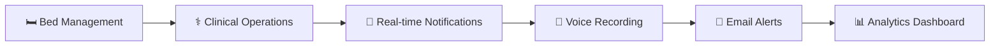
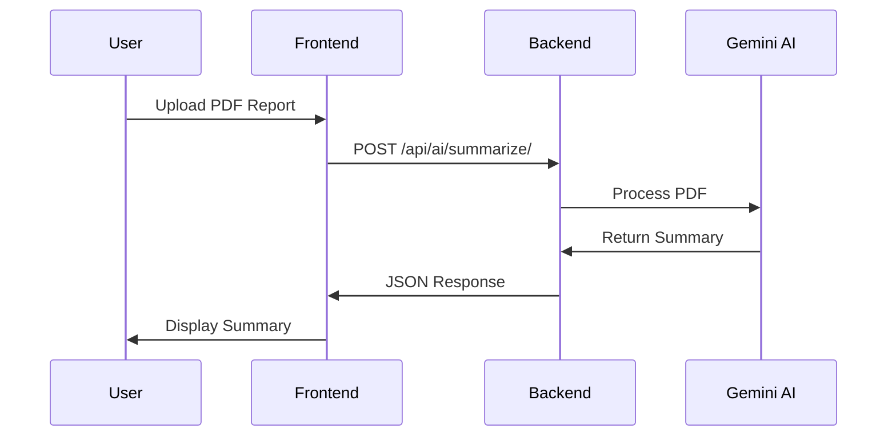

<div align="center">

# 🏥 Clinify - Hospital Information System

### *Transforming Healthcare Through Digital Innovation*

[](https://www.djangoproject.com/)
[](https://reactjs.org/)
[](https://www.postgresql.org/)
[](https://ai.google.dev/)
[](https://tailwindcss.com/)

[Features](#-key-features) • [Tech Stack](#-tech-stack) • [Installation](#-installation) • [Usage](#-usage) • [AI Integration](#-ai-powered-features) • [Contributing](#-contributing)

</div>

---

## 📖 About The Project

**Clinify** is a comprehensive, enterprise-grade Hospital Information System (HIS) designed to digitize and streamline healthcare operations across multiple departments. Built with modern technologies and AI integration, it provides a unified platform for patient care, clinical operations, pharmacy management, and administrative tasks.

### 🎯 Vision

To create a seamless digital ecosystem that empowers healthcare professionals to deliver better patient care through intelligent automation, real-time data access, and AI-assisted decision-making.

---

## ✨ Key Features

<table>
<tr>
<td width="50%">

### 👥 Multi-Role Support
- 🔐 **7 Specialized Roles**
  - Admin
  - Doctor
  - Nurse
  - Receptionist
  - Lab Technician
  - Pharmacist
  - Billing Staff
- 🎨 Role-specific dashboards
- 🔒 Granular permission controls

</td>
<td width="50%">

### 📊 Patient Management
- 📋 Complete EHR (Electronic Health Records)
- 🏥 Visit & Admission tracking
- 🩺 Medical history management
- 💊 Allergy tracking
- 📈 Real-time vital signs monitoring

</td>
</tr>
<tr>
<td width="50%">

### 🤖 AI-Powered Features
- 🧠 **Gemini AI Integration**
- 📄 Lab report summarization
- 🎤 Voice-to-text clinical notes
- ✍️ AI grammar & formatting
- 🔍 Intelligent data analysis

</td>
<td width="50%">

### 💊 Pharmacy System
- 📦 Inventory management
- 🔄 Batch tracking & expiry alerts
- ⚠️ Drug interaction warnings
- 💳 Prescription dispensing
- 📊 Stock transaction logs

</td>
</tr>
<tr>
<td width="50%">

### 🔬 Lab & Radiology
- 🧪 Test ordering system
- 📋 Result management
- 📄 PDF report generation
- 🤖 AI-powered analysis
- 📊 Test history tracking

</td>
<td width="50%">

### 💰 Billing & Insurance
- 🧾 Automated billing
- 📝 Itemized invoices
- 💳 Payment tracking
- 🏥 Insurance claim processing
- 📊 Revenue analytics

</td>
</tr>
</table>

### 🏥 Additional Capabilities



---

## 🛠️ Tech Stack

### Frontend Architecture

```
┌─────────────────────────────────────────┐
│         React 19 + Vite                 │
├─────────────────────────────────────────┤
│  • Tailwind CSS 4 - Styling             │
│  • React Router DOM - Navigation        │
│  • Axios - API Communication            │
│  • Recharts - Data Visualization        │
│  • Context API - State Management       │
│  • Speech API - Voice Recording         │
└─────────────────────────────────────────┘
```

### Backend Architecture

```
┌─────────────────────────────────────────┐
│      Django 6.0.1 + DRF                 │
├─────────────────────────────────────────┤
│  • PostgreSQL - Database                │
│  • JWT - Authentication                 │
│  • CORS - Cross-Origin Handling         │
│  • Google Gemini AI - ML Integration    │
│  • PyPDF2 - PDF Processing              │
│  • ReportLab - PDF Generation           │
└─────────────────────────────────────────┘
```

### 📦 Core Dependencies

<details>
<summary><b>Backend Dependencies</b></summary>

```txt
Django==6.0.1
djangorestframework==3.15.2
djangorestframework-simplejwt==5.4.0
psycopg2-binary==2.9.10
django-cors-headers==4.6.0
python-dotenv==1.0.1
google-genai==1.0.0
PyPDF2==3.0.1
reportlab==4.0.9
pillow==11.0.0
```

</details>

<details>
<summary><b>Frontend Dependencies</b></summary>

```json
{
  "react": "^19.2.0",
  "react-dom": "^19.2.0",
  "react-router-dom": "^7.12.0",
  "axios": "^1.13.2",
  "tailwindcss": "^4.1.18",
  "recharts": "^3.7.0",
  "vite": "^7.2.4"
}
```

</details>

---

## 🚀 Installation

### Prerequisites

```bash
# Required Software
✓ Python 3.10+
✓ Node.js 18+
✓ PostgreSQL 14+
✓ Git
```

### 📥 Clone Repository

```bash
git clone https://github.com/AtharvaLotankar11/Clinify_Hospital_Project.git
cd Clinify_Hospital_Project
```

### 🔧 Backend Setup

```bash
# Navigate to backend
cd backend

# Create virtual environment
python -m venv venv

# Activate virtual environment
# Windows
venv\Scripts\activate
# Linux/Mac
source venv/bin/activate

# Install dependencies
pip install -r requirements.txt

# Create .env file
echo "GEMINI_API_KEY=your_gemini_api_key_here" > .env
echo "EMAIL_HOST_USER=your_email@gmail.com" >> .env
echo "EMAIL_HOST_PASSWORD=your_app_password" >> .env

# Configure database in backend/his/settings.py
# Update DATABASES settings with your PostgreSQL credentials

# Run migrations
python manage.py migrate

# Create superuser
python manage.py createsuperuser

# Load seed data (optional)
python manage.py loaddata seed_data.py

# Start development server
python manage.py runserver
```

### 🎨 Frontend Setup

```bash
# Navigate to frontend
cd frontend

# Install dependencies
npm install

# Start development server
npm run dev
```

### 🌐 Access Application

```
Frontend: http://localhost:5173
Backend:  http://localhost:8000
Admin:    http://localhost:8000/admin
```

---

## 🤖 AI-Powered Features

### 1️⃣ Lab Report Summarization

<div align="center">



</div>

#### 📋 Features
- 📄 PDF upload and processing
- 🧠 AI-powered analysis using Gemini Pro/Flash
- 📊 Structured summary generation
- 🔒 Secure JWT authentication
- 📝 Audit logging for compliance

#### 🔌 API Endpoint

```javascript
POST /api/ai/summarize/
Content-Type: multipart/form-data
Authorization: Bearer <JWT_TOKEN>

{
  "file": <PDF_FILE>
}
```

#### 💡 Usage Flow

```
1. Login as Doctor/Lab Technician
2. Navigate to Lab Summary page
3. Upload PDF lab report
4. View AI-generated summary
5. Summary logged in database
```

---

### 2️⃣ Voice-Based Clinical Notes

<div align="center">


</div>

#### 🎙️ Features
- 🎤 **Real-time voice-to-text** using Browser Speech API
- ✍️ **Editable transcripts** for human review
- 🤖 **AI Grammar Correction** via Gemini
- 📝 **Professional formatting** (bullets, paragraphs)
- 🔄 **Auto-restart** on silence detection
- ⚠️ **Safety warnings** and error handling

#### 🔧 Component Usage

```jsx
import VoiceRecorder from './components/VoiceRecorder';

<VoiceRecorder
  onTranscriptChange={(text) => setProgressNote(text)}
  initialValue={existingNote}
/>
```

#### 🎯 Workflow

```
┌─────────────────────────────────────────┐
│  1. Click "Start Recording" 🎤          │
│  2. Speak clinical notes                │
│  3. Click "Stop Recording" ⏹️           │
│  4. Review & edit transcript ✏️         │
│  5. Click "AI Fix Grammar" ✨           │
│  6. Review polished text 📝             │
│  7. Save progress note 💾               │
└─────────────────────────────────────────┘
```

#### 🔌 AI Grammar API

```javascript
POST /api/ai/fix-grammar/
Content-Type: application/json
Authorization: Bearer <JWT_TOKEN>

{
  "text": "raw clinical note text"
}

Response:
{
  "refined_text": "Professionally formatted clinical note..."
}
```

#### ✅ Integration Points

| Role | Location | Feature |
|------|----------|---------|
| 👨‍⚕️ Doctor | `PatientDetailsModal.jsx` | Progress Notes Tab |
| 👩‍⚕️ Nurse | `Dashboard.jsx` | Add Progress Notes |

---

## 📱 User Roles & Workflows

### 🔐 Admin Dashboard
```
✓ User management (Create/Edit/Delete)
✓ Role assignment
✓ System configuration
✓ Analytics & reports
✓ Audit logs
```

### 👨‍⚕️ Doctor Dashboard
```
✓ Patient list & search
✓ Visit management
✓ Clinical notes (voice-enabled)
✓ Order management (Lab/Radiology/Pharmacy)
✓ EHR access
✓ AI lab report summaries
```

### 👩‍⚕️ Nurse Dashboard
```
✓ Vital signs recording
✓ Bed management
✓ Progress notes (voice-enabled)
✓ Medication administration
✓ Patient monitoring
```

### 🏥 Receptionist Dashboard
```
✓ Patient registration
✓ Visit creation
✓ Admission management
✓ Appointment scheduling
✓ Patient search
```

### 🔬 Lab Technician Dashboard
```
✓ Test order management
✓ Result entry
✓ Report generation
✓ AI-powered analysis
```

### 💊 Pharmacist Dashboard
```
✓ Prescription management
✓ Medicine dispensing
✓ Inventory control
✓ Drug interaction alerts
✓ Expiry tracking
```

### 💰 Billing Staff Dashboard
```
✓ Bill creation
✓ Payment processing
✓ Insurance claims
✓ Revenue reports
```

---

## 🗂️ Project Structure

```
Clinify_Hospital_Project/
├── 📁 backend/
│   ├── 📁 his/                    # Django project settings
│   │   ├── settings.py
│   │   ├── urls.py
│   │   └── wsgi.py
│   ├── 📁 people/                 # Core app (Patient, Staff, etc.)
│   │   ├── models.py
│   │   ├── views.py
│   │   ├── serializers.py
│   │   └── urls.py
│   ├── 📁 ai_services/            # AI integration app
│   │   ├── services/
│   │   │   └── gemini_service.py
│   │   ├── views.py
│   │   └── urls.py
│   ├── manage.py
│   └── requirements.txt
│
├── 📁 frontend/
│   ├── 📁 src/
│   │   ├── 📁 components/
│   │   │   ├── Header.jsx
│   │   │   ├── Sidebar.jsx
│   │   │   ├── VoiceRecorder.jsx  # 🎤 Voice component
│   │   │   └── NotificationBell.jsx
│   │   ├── 📁 pages/
│   │   │   ├── 📁 admin/
│   │   │   ├── 📁 doctor/
│   │   │   ├── 📁 nurse/
│   │   │   ├── 📁 lab/
│   │   │   ├── 📁 pharmacy/
│   │   │   ├── 📁 billing/
│   │   │   └── 📁 reception/
│   │   ├── 📁 context/
│   │   │   └── AuthContext.jsx
│   │   ├── 📁 services/
│   │   │   └── api.js
│   │   └── App.jsx
│   ├── package.json
│   └── vite.config.js
│
└── 📄 README.md
```

---

## 🔒 Security Features

```
🔐 JWT-based authentication
🛡️ Role-based access control (RBAC)
🔒 HTTPS/SSL support
🚫 CORS protection
🔑 Environment-based secrets
📝 Audit logging
🔐 Password hashing
⚠️ Input validation
```

---

## 📊 Database Schema

<details>
<summary><b>Core Models</b></summary>

```python
# Key Models
├── Patient          # Patient demographics & medical history
├── Staff            # Healthcare professionals
├── Visit            # Outpatient visits
├── Admission        # Inpatient admissions
├── Bed              # Bed management
├── Vital            # Vital signs
├── ClinicalNote     # Progress notes
├── Order            # Doctor orders
├── LabTest          # Laboratory tests
├── RadiologyTest    # Radiology exams
├── Medicine         # Pharmacy inventory
├── Prescription     # Medication orders
├── Bill             # Billing records
├── Notification     # System notifications
└── AIRequestLog     # AI usage audit
```

</details>

---

## 🎨 UI/UX Highlights

- 🎨 **Modern Design**: Tailwind CSS with medical theme
- 📱 **Responsive**: Mobile-first approach
- 🌙 **Clean Interface**: Intuitive navigation
- 🎯 **Role-based UI**: Customized dashboards
- 📊 **Data Visualization**: Charts and graphs
- 🔔 **Real-time Updates**: Notification system
- ⚡ **Fast Performance**: Optimized loading

---

## 🧪 Testing

```bash
# Backend tests
cd backend
python manage.py test

# Frontend tests
cd frontend
npm run test
```

---

## 📈 Future Enhancements

- [ ] 📱 Mobile app (React Native)
- [ ] 🌐 Multi-language support
- [ ] 📊 Advanced analytics dashboard
- [ ] 🔗 HL7/FHIR integration
- [ ] 🤖 More AI features (diagnosis assistance)
- [ ] 📞 Telemedicine integration
- [ ] 🔔 SMS notifications
- [ ] 📸 Image recognition for prescriptions

---

## 🤝 Contributing

Contributions are welcome! Please follow these steps:

1. 🍴 Fork the repository
2. 🌿 Create feature branch (`git checkout -b feature/AmazingFeature`)
3. 💾 Commit changes (`git commit -m 'Add AmazingFeature'`)
4. 📤 Push to branch (`git push origin feature/AmazingFeature`)
5. 🔃 Open Pull Request

---

## 📝 License

This project is licensed under the MIT License - see the [LICENSE](LICENSE) file for details.

---

## 👥 Authors

**Atharva Lotankar**
- GitHub: [@AtharvaLotankar11](https://github.com/AtharvaLotankar11)

---

## 🙏 Acknowledgments

- Google Gemini AI for intelligent features
- Django & React communities
- Open-source contributors
- Healthcare professionals for domain expertise

---

## 📞 Support

For issues and questions:
- 🐛 [Report Bug](https://github.com/AtharvaLotankar11/Clinify_Hospital_Project/issues)
- 💡 [Request Feature](https://github.com/AtharvaLotankar11/Clinify_Hospital_Project/issues)
- 📧 Email: support@clinify.com

---

<div align="center">

### ⭐ Star this repository if you find it helpful!

Made with ❤️ for better healthcare

[](https://github.com/AtharvaLotankar11/Clinify_Hospital_Project/stargazers)
[](https://github.com/AtharvaLotankar11/Clinify_Hospital_Project/network/members)

</div>
